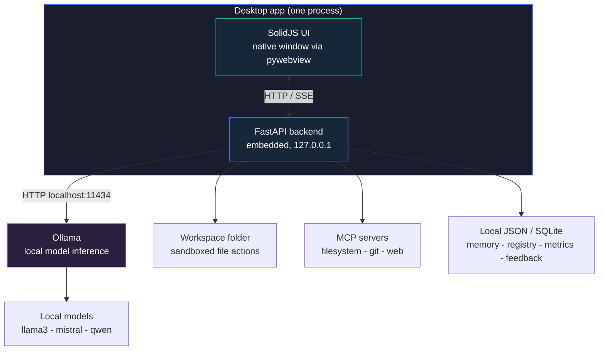
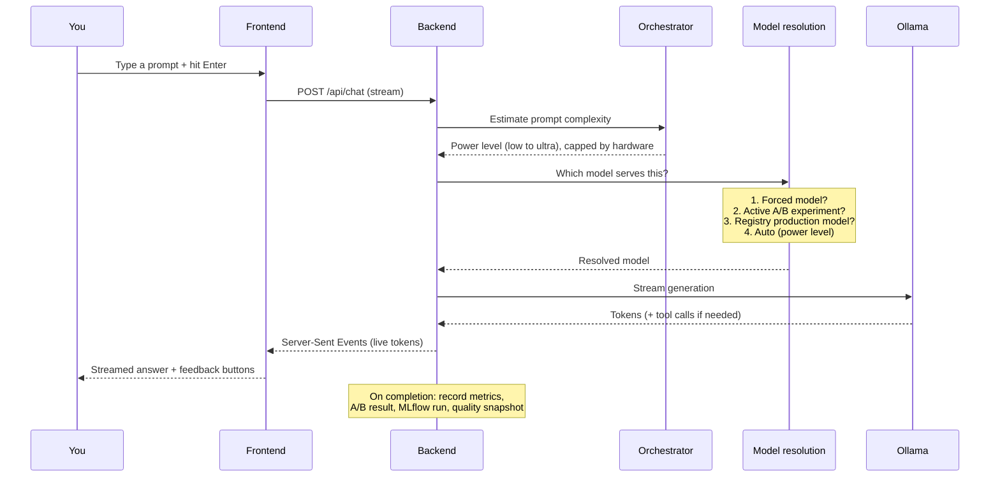
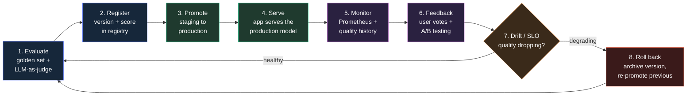
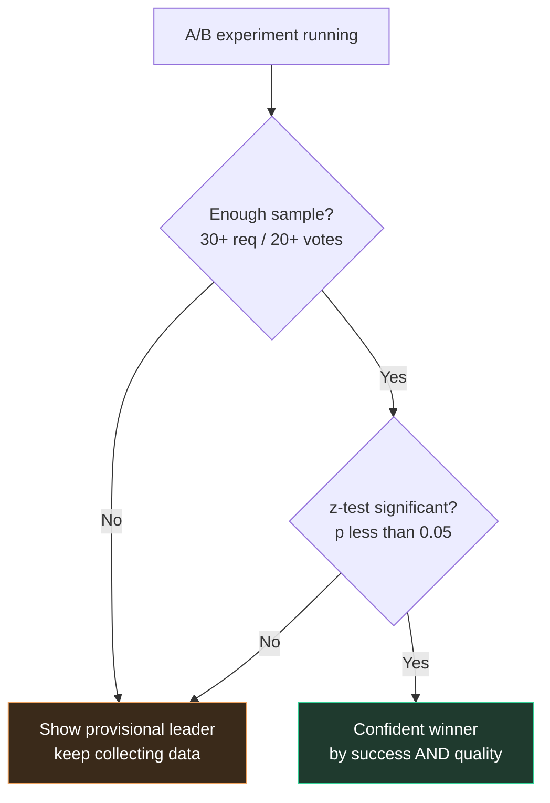
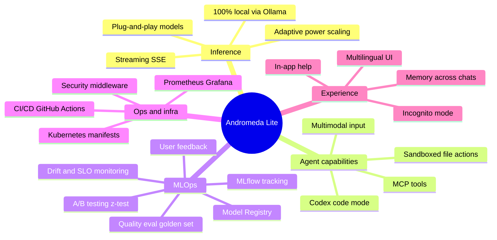

<div align="center">

# 🌌 Andromeda Lite

**A desktop app that runs local AI models and manages their full MLOps lifecycle.**

Open source, offline, and private by default.

[](LICENSE)
[](../../actions/workflows/ci.yml)
[](../../actions/workflows/release.yml)


</div>

---

## Table of contents

1. [What is Andromeda Lite?](#1-what-is-andromeda-lite)
2. [The 30-second tour](#2-the-30-second-tour)
3. [System architecture](#3-system-architecture)
4. [How a single request flows](#4-how-a-single-request-flows)
5. [The MLOps lifecycle](#5-the-mlops-lifecycle)
6. [Feature map](#6-feature-map)
7. [MLOps maturity mapping](#7-mlops-maturity-mapping)
8. [Tech stack](#8-tech-stack)
9. [Project structure](#9-project-structure)
10. [Quick start](#10-quick-start)
11. [Testing, quality & security](#11-testing-quality--security)
12. [Design principles](#12-design-principles)

---

## 1. What is Andromeda Lite?

Andromeda Lite runs language models on your own machine through [Ollama](https://ollama.com), so there's no cloud, no token limits, and nothing leaves your computer. It's more than a chat window on top of Ollama, though. It wraps a local model in a desktop app that can read and write files, call tools, pick the right model for each prompt, and manage the whole lifecycle of evaluating, versioning, promoting and monitoring those models.

I built it with two goals in mind. First, a genuinely useful offline AI app that anyone can install and use. Second, a place to implement the operational side of MLOps end to end and see it working, rather than describing it on a slide.

| | What it covers |
|---|---|
| 🧑‍💻 As a product | An offline desktop app: pull a model, chat with it, hand it files and tools. |
| 🛠️ As an MLOps project | The serving, experimentation and observability parts of the ML lifecycle, running for real. |

---

## 2. The 30-second tour

- **Fully local inference.** Prompts and files never leave your machine, and it works offline.
- **Adaptive model selection.** The app reads how complex a prompt is and picks a power level from low to ultra, within what your hardware can run. You can override it whenever you want.
- **Sandboxed file actions.** The AI can read, write, move and delete files inside a workspace folder, using explicit action blocks that are reversible.
- **MCP tools.** Connect Model Context Protocol servers (filesystem, git, web) in one click and the AI calls them when it needs to.
- **Model registry, A/B testing and quality evaluation.** Version your models, promote the best one to production, compare two of them in real use with a proper statistical test, and track quality against SLOs over time.
- **Plug-and-play models.** Anything you `ollama pull` shows up automatically. There are no config files to edit.
- **Private by default.** Incognito mode keeps nothing, and network egress is off unless you turn it on.
- **Five languages.** English, Spanish, German, Chinese and French.

---

## 3. System architecture

The whole thing is a single desktop process: a native window (pywebview) that hosts a SolidJS UI, an embedded FastAPI backend, and a small client that talks to a local Ollama server. No Docker, no accounts, no external services.



The idea behind this shape is simple: everything runs locally and privately. The backend is embedded rather than a separate server you have to manage, Ollama is the only external dependency, and all the state lives in plain files on your disk that you can open or delete yourself.

---

## 4. How a single request flows

Lite uses one model at a time and adapts its power, instead of running several in parallel. Here is what happens from the moment you press Enter:



The power-level decision is deterministic and explainable. The app shows you why it picked a level, and you can pin one by hand.

| Prompt | Level |
|--------|-------|
| "thanks, that worked" | low |
| "explain how photosynthesis works" | mid |
| "refactor this function and analyze its time complexity" | high |
| "design a distributed system and prove its correctness step by step" | ultra |

---

## 5. The MLOps lifecycle

This is the part that makes Andromeda more than a chat app. For a product that serves models rather than trains them, MLOps comes down to three questions: which model should I serve, how do I prove it is actually better, and how do I notice when it gets worse. Andromeda implements that whole loop, and the app runs on it.



### The loop, step by step

| Step | What it does | Where |
|------|--------------|-------|
| 1. Evaluate (offline) | An LLM-as-judge scores a model 1–5 against a golden set across categories (factual, reasoning, code, safety…). Runs on demand or in CI. | `eval/quality_eval.py`, `eval/golden_set.jsonl` |
| 2. Register | Save a model version with its eval score and notes. Auto-versioned (v1, v2…). | `backend/app/mlops/registry.py` |
| 3. Promote | Move a version `staging → production`. Only one production version at a time; promoting another archives the previous one. | `POST /api/registry/{id}/promote` |
| 4. Serve | With *Serve production model* on, the chat serves exactly the promoted version (unless you force a model or an A/B is active). | `backend/app/routes/chat.py` |
| 5. Monitor | Prometheus metrics (`/metrics`) + a quality time-series (success, latency, satisfaction) snapshotted every 5 min. | `backend/app/observability/`, `quality_history.py` |
| 6. Feedback & A/B | 👍/👎 on each answer becomes a quality signal; A/B experiments compare two models in real traffic. | `backend/app/mlops/feedback.py`, `ab_testing.py` |
| 7. Drift & SLO | The quality history compares recent vs. prior windows (improving/stable/degrading) and checks SLO thresholds (success ≥ 95%, p95 ≤ 8s, satisfaction ≥ 70%). | `backend/app/mlops/quality_history.py` |
| 8. Roll back | If satisfaction drops, archive the version and re-promote the previous one. Rollback is a single click. | Model Registry UI |

### How a winner is decided

The A/B testing doesn't pick a winner by eye. It runs a two-proportion z-test and only calls a confident winner when there is enough sample and `p < 0.05`, on both success rate and user satisfaction. Below that bar it shows a provisional leader and tells you it's still collecting data.



---

## 6. Feature map



---

## 7. MLOps maturity mapping

If you're reviewing this as MLOps work, here's how each piece maps to a standard practice. Andromeda serves and operates models rather than training them, so the table covers the deployment and operations side of the lifecycle.

| MLOps practice | How Andromeda implements it |
|----------------|-----------------------------|
| **Experiment tracking** | MLflow integration logs runs with params (model, strategy, hardware tier) and metrics (latency, TTFT, success). |
| **Model registry & versioning** | First-class registry with `staging → production → archived` stages and exclusive production promotion. |
| **Continuous evaluation** | Golden-set + LLM-as-judge harness, runnable in CI as a quality gate before promotion. |
| **Online evaluation** | Per-response 👍/👎 feedback feeding satisfaction metrics and A/B variants. |
| **Experimentation** | A/B framework with two-proportion z-test and minimum-sample gating. |
| **Observability** | Prometheus exposition endpoint, Grafana dashboard, hand-rolled metrics with no heavy deps. |
| **Monitoring & alerting** | SLO thresholds + drift detection over a quality time-series; Prometheus alert rules. |
| **CI/CD** | GitHub Actions: tests, lint, frontend build, Docker build, security scan, k8s manifest validation. |
| **Infrastructure as code** | Full Kubernetes manifest set (Deployments, HPA, PDB, NetworkPolicy, ServiceMonitor) + Kustomize. |
| **Rollback strategy** | One-click archive + re-promote of the previous production model. |
| **Reproducibility** | Deterministic orchestration; pinned deps; config captured in MLflow runs. |
| **Security** | Localhost-only CORS allowlist, sandboxed execution, security middleware stack, `bandit` clean. |

More detailed docs for the MLOps stack are in [`deploy/README.md`](deploy/README.md).

---

## 8. Tech stack

| Layer | Technology |
|-------|-----------|
| Frontend | SolidJS, Vite |
| Backend | FastAPI, Python 3.12, httpx |
| Inference | Ollama (local) |
| Desktop packaging | pywebview + PyInstaller (no Docker) |
| Experiment tracking | MLflow |
| Observability | Prometheus + Grafana |
| Orchestration | Kubernetes (+ Kustomize) |
| CI/CD | GitHub Actions |
| Security scanning | bandit, pip-audit |

---

## 9. Project structure

```
andromeda-lite/
├── backend/app/
│   ├── core/            # Orchestrator, flags, file actions, sandboxed subprocess
│   ├── hardware/        # Hardware detection + tier policy (VRAM/RAM aware)
│   ├── mcp/             # Model Context Protocol client + built-in tools
│   ├── memory/          # Semantic store + unified memory profile
│   ├── mlops/           # *** Registry, A/B testing, stats, feedback,
│   │                    #     quality history (drift/SLO), MLflow client
│   ├── observability/   # Metrics collector, tracer, Prometheus exposition
│   ├── routes/          # 26 API routers (chat, registry, ab, feedback, health…)
│   └── __init__.py      # App factory + lifespan (background tasks)
├── frontend/src/
│   ├── components/      # SolidJS UI (Chat, panels, charts, InfoButton…)
│   └── stores/          # State + i18n (5 languages)
├── eval/                # Golden set + LLM-as-judge harness
├── deploy/
│   ├── k8s/             # Kubernetes manifests + Kustomize
│   ├── monitoring/      # Prometheus, Grafana, alert rules
│   └── mlflow/          # MLflow tracking server
├── tests/               # 160 passing tests
├── .github/workflows/   # CI/CD pipelines
└── desktop.py           # Desktop entry point (pywebview + embedded backend)
```

---

## 10. Quick start

**Requirements:** [Ollama](https://ollama.com/download) installed and running. To build from source: Python 3.12+ and Node 18+.

```bash
# 1. Pull a model (any size your hardware can handle)
ollama pull llama3.2:3b       # light and fast, a good starting point
# or: ollama pull qwen2.5:7b   # more capable, needs more VRAM

# 2. Clone
git clone https://github.com/PauAlonsoRacero/andromeda-lite.git
cd andromeda-lite

# 3a. Run from source (backend)
cd backend
pip install -r requirements.txt
uvicorn app:create_app --factory --port 8000 &

# 3b. Run from source (frontend)
cd ../frontend
npm install
npm run dev
```

Open the app, pick the model you pulled, and start chatting. The orchestrator takes care of the rest.

On Windows the easiest path is the installer attached to each [release](../../releases), which sets up everything for you. If you'd rather not build anything, `RUN-WINDOWS.bat` runs it straight from source.

### Try the MLOps loop in 2 minutes

```bash
# Evaluate a model against the golden set and register it with its score
python eval/quality_eval.py --model llama3.2:3b --judge qwen2.5:7b --register
```

Then open Settings → Model Registry, promote the version to production, turn on "Serve production model", and start chatting. You're now serving the exact version you promoted. Head to Analytics → Quality & SLO to watch the satisfaction and latency series fill in.

---

## 11. Testing, quality & security

| Aspect | Status |
|--------|--------|
| Backend tests | **160 passing** (`pytest`) |
| Frontend build | 120 modules, clean |
| Static security scan | `bandit`, 0 medium or high issues |
| Dependency audit | `pip-audit` in CI |
| Dead code | `pyflakes` clean in `backend/app` |
| CI gates | tests · lint · frontend build · Docker build · security · k8s validation |

```bash
# Run the test suite
PYTHONPATH=backend pytest tests/ -q

# Security scan
bandit -r backend/app -ll
```

On the security side: CORS is a localhost allowlist and never `*`, code execution is sandboxed with a temp directory, a timeout and a restricted environment, subprocesses run windowless and never use `shell=True` on untrusted input, there are no hardcoded secrets, and a middleware stack handles auth gating, security headers, rate limiting and request IDs.

---

## 12. Design principles

- **Local and private.** Your data stays on your machine, and network egress and telemetry are off by default.
- **Plug-and-play.** Pull a model and it shows up. No YAML to edit, no glue code to write.
- **Explainable.** The orchestrator shows why it chose a power level, and the A/B testing shows why a model wins, with the p-values behind it.
- **Real, not decorative.** The CI/CD, Kubernetes, monitoring and A/B pieces actually work and are tested. They aren't there just for show.
- **Clear about scope.** Andromeda serves and operates models, it doesn't train them. The MLOps side is the deployment and operations lifecycle, built end to end.

---

<div align="center">

Andromeda Lite is MIT-licensed and free. A commercial Pro edition with multi-model orchestration, fine-tuning, multi-user support and RAG is in the works.

</div>
